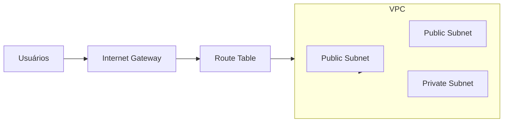
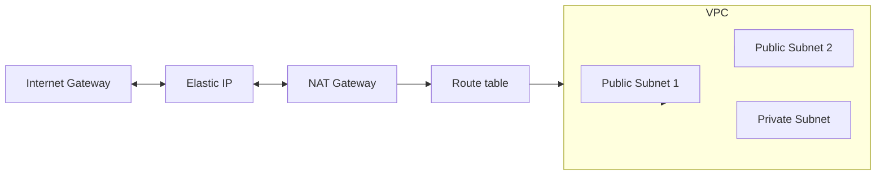

# Auto Scaling Group Com Load Balancer na AWS usando Terraform
Projeto para criação na AWS de um Auto Scaling Group com 2 instâncias e um Elastic Load Balancer para distribuir o tráfego de rede entre elas da internet.

1 - Criada uma VPC com 3 subnets, uma privada (para as maquinas) e duas publicas (para o load balancer).

2 - Criado um Internet Gateway para as subnets publicas, usando uma route table entre eles para realizar a conexão, o Internet Gateway é para as redes ficarem abertas para a internet.

 ### Diagrama de Rede VPC

3 - Criado um Elastic Ip e um NAT Gateway (para que as intancias possam acesssar a internet), isso tambem com uma route table associada.

### Diagrama de Rede VPC com NAT Gateway

4 - Criado Load balancer para lidar com requests HTTP e HTTPS.

5 - Criado Auto Scaling Group para realizar a criação ou destruição das maquinas de acordo com a demanda. Usando um launch template para consistencia na criação da instâncias.

6 - Configurada Auto Scaling Policy no Clodwatch para escalar horizontalmente as instâncias se o número de requisições por minuto for igual ou superior a 60.

7 - Criado Security Group com as regras de acesso as instâncias no EC2 e ao Load Balancer

## Requirements

| Name | Version |
|------|---------|
|AWS CLI|000|
|------|---------|

## Providers

| Name | Version |
|------|---------|
|  [aws](#provider\_aws) | 5.65.0 |

## Modules

No modules.

## Resources

| Name | Type |
|------|------|
| [aws_autoscaling_group.asg](https://registry.terraform.io/providers/hashicorp/aws/latest/docs/resources/autoscaling_group) | resource |
| [aws_autoscaling_policy.scale_in_policy](https://registry.terraform.io/providers/hashicorp/aws/latest/docs/resources/autoscaling_policy) | resource |
| [aws_autoscaling_policy.scale_out_policy](https://registry.terraform.io/providers/hashicorp/aws/latest/docs/resources/autoscaling_policy) | resource |
| [aws_cloudwatch_metric_alarm.requests_alarm](https://registry.terraform.io/providers/hashicorp/aws/latest/docs/resources/cloudwatch_metric_alarm) | resource |
| [aws_eip.eip](https://registry.terraform.io/providers/hashicorp/aws/latest/docs/resources/eip) | resource |
| [aws_internet_gateway.internet_gtw](https://registry.terraform.io/providers/hashicorp/aws/latest/docs/resources/internet_gateway) | resource |
| [aws_launch_template.ec2_template](https://registry.terraform.io/providers/hashicorp/aws/latest/docs/resources/launch_template) | resource |
| [aws_lb.load_balancer](https://registry.terraform.io/providers/hashicorp/aws/latest/docs/resources/lb) | resource |
| [aws_lb_listener.listener](https://registry.terraform.io/providers/hashicorp/aws/latest/docs/resources/lb_listener) | resource |
| [aws_lb_target_group.lb_target](https://registry.terraform.io/providers/hashicorp/aws/latest/docs/resources/lb_target_group) | resource |
| [aws_nat_gateway.priv_sub_nat](https://registry.terraform.io/providers/hashicorp/aws/latest/docs/resources/nat_gateway) | resource |
| [aws_route_table.priv_rt](https://registry.terraform.io/providers/hashicorp/aws/latest/docs/resources/route_table) | resource |
| [aws_route_table.pub_rt](https://registry.terraform.io/providers/hashicorp/aws/latest/docs/resources/route_table) | resource |
| [aws_route_table_association.rt_ass_3](https://registry.terraform.io/providers/hashicorp/aws/latest/docs/resources/route_table_association) | resource |
| [aws_route_table_association.rta_1a](https://registry.terraform.io/providers/hashicorp/aws/latest/docs/resources/route_table_association) | resource |
| [aws_route_table_association.rta_1b](https://registry.terraform.io/providers/hashicorp/aws/latest/docs/resources/route_table_association) | resource |
| [aws_security_group.security_group_ec2](https://registry.terraform.io/providers/hashicorp/aws/latest/docs/resources/security_group) | resource |
| [aws_security_group.security_group_elb](https://registry.terraform.io/providers/hashicorp/aws/latest/docs/resources/security_group) | resource |
| [aws_subnet.priv_subnet_1a](https://registry.terraform.io/providers/hashicorp/aws/latest/docs/resources/subnet) | resource |
| [aws_subnet.pub_subnet_1a](https://registry.terraform.io/providers/hashicorp/aws/latest/docs/resources/subnet) | resource |
| [aws_subnet.pub_subnet_1b](https://registry.terraform.io/providers/hashicorp/aws/latest/docs/resources/subnet) | resource |
| [aws_vpc.vpc](https://registry.terraform.io/providers/hashicorp/aws/latest/docs/resources/vpc) | resource |

## Inputs

| Name | Description | Type | Default | Required |
|------|-------------|------|---------|:--------:|
|  [alarm\_name](#input\_alarm\_name) | Nome do alarme | `any` | n/a | yes |
|  [ami\_id](#input\_ami\_id) | ID da AMI a ser usada | `any` | n/a | yes |
|  [ec2\_instance\_name](#input\_ec2\_instance\_name) | Nome para a instância EC2 | `any` | n/a | yes |
|  [eip\_name](#input\_eip\_name) | Nome do Elastic IP | `any` | n/a | yes |
|  [load\_balancer\_name](#input\_load\_balancer\_name) | Nome do Load Balancer | `any` | n/a | yes |
|  [load\_balancer\_target](#input\_load\_balancer\_target) | Nome do Target Group do Load Balancer | `any` | n/a | yes |
|  [priv\_sub\_nat\_name](#input\_priv\_sub\_nat\_name) | Nome do NAT para a Subnet Privada | `any` | n/a | yes |
|  [security\_group\_ec2\_name](#input\_security\_group\_ec2\_name) | Nome do Security Group para a instância EC2 | `any` | n/a | yes |
|  [security\_group\_elb\_name](#input\_security\_group\_elb\_name) | Nome do Security Group para o ELB | `any` | n/a | yes |
|  [user\_data\_script](#input\_user\_data\_script) | Script de user data para a instância | `any` | n/a | yes |
|  [vpc\_name](#input\_vpc\_name) | Nome da VPC | `any` | n/a | yes |

## Outputs

No outputs.
