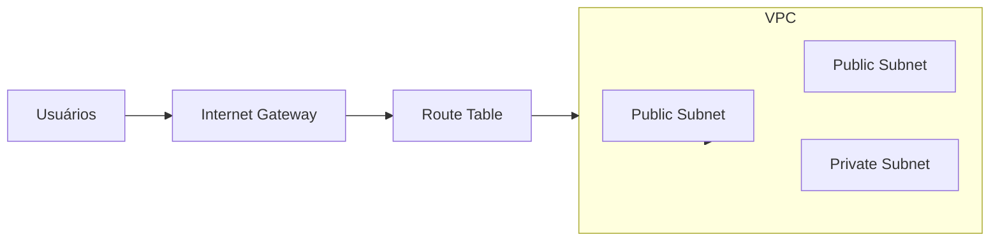
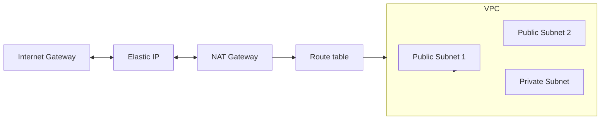

# Auto Scaling Group Com Load Balancer na AWS usando Terraform
Projeto para criação na AWS de um Auto Scaling Group com 2 instâncias e um Elastic Load Balancer para distribuir o tráfego de rede entre elas da internet.

1 - Criada uma VPC com 3 subnets, uma privada (para as maquinas) e duas publicas (para o load balancer).

2 - Criado um Internet Gateway para as subnets publicas, usando uma route table entre eles para realizar a conexão, o Internet Gateway é para as redes ficarem abertas para a internet.

 ### Diagrama de Rede VPC

3 - Criado um Elastic Ip e um NAT Gateway (para que as intancias possam acesssar a internet), isso tambem com uma route table associada.

### Diagrama de Rede VPC com NAT Gateway

4 - Criado Load balancer para lidar com requests HTTP e HTTPS.

5 - Criado Auto Scaling Group para realizar a criação ou destruição das maquinas de acordo com a demanda. Usando um launch template para consistencia na criação da instâncias.

6 - Criado Security Group com as regras de acesso as instâncias no EC2 e ao Load Balancer